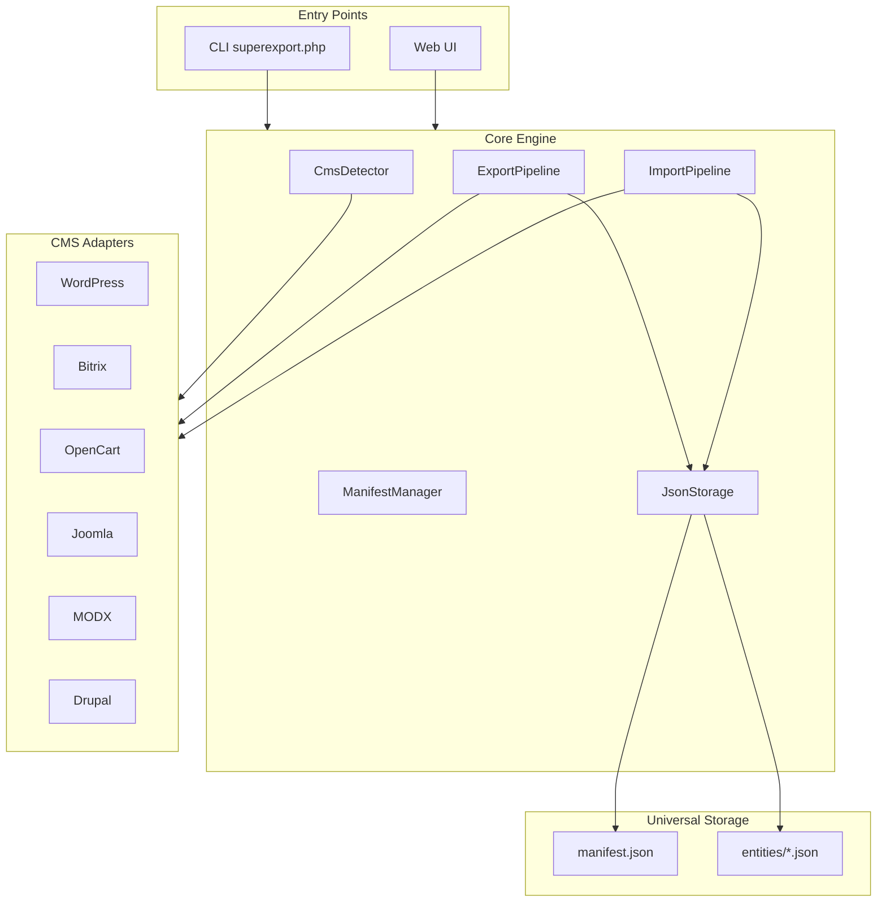
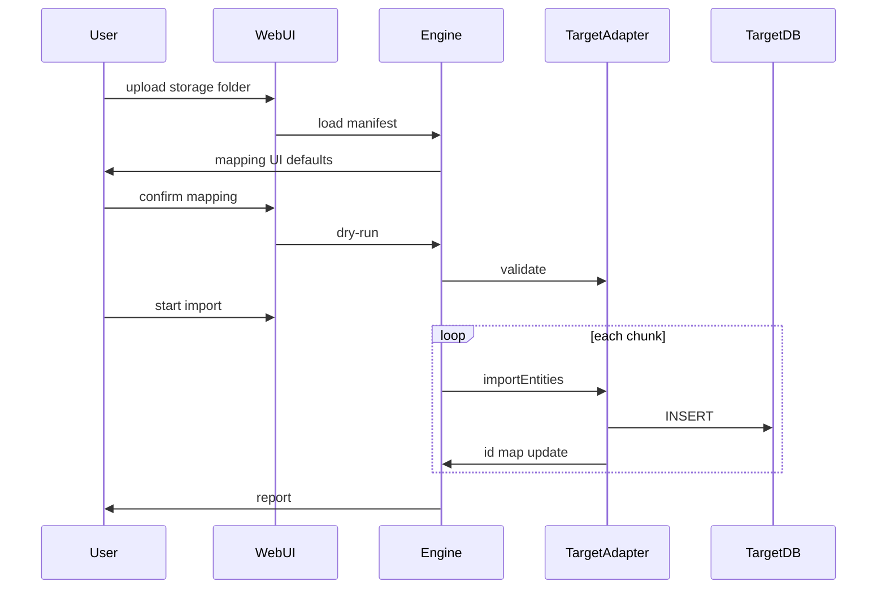

# SuperExporter — дизайн и план реализации

## Контекст

Проект пустой: только [`superexport.php`](superexport.php). Требования уточнены:

| Решение | Выбор |
|---------|-------|
| Область данных | Контент: посты/страницы/товары, категории, теги, мета-поля |
| Хранилище | JSON-файлы + `manifest.json` (схема, маппинг, версия) |
| Интерфейс | Веб + CLI |
| CMS MVP | Явные адаптеры: **WP, Bitrix, OpenCart, Joomla, MODX, Drupal** |
| Безопасность веба | Секретный ключ в `config.php` |
| Кросс-CMS | Универсальная каноническая схема + режим настройки при импорте |

---

## Подходы (2–3 варианта)

### A. Адаптеры + каноническая схема (рекомендуется)

Каждая CMS — класс-адаптер (`detect`, `export`, `import`). Ядро знает только универсальные сущности. Адаптеры транслируют БД ↔ JSON.

- **Плюсы:** предсказуемый кросс-CMS импорт, тестируемость, расширяемость
- **Минусы:** 6 адаптеров — значительный объём работы

### B. Авто-интроспекция БД без адаптеров

Сканирование таблиц, FK, эвристики по именам колонок.

- **Плюсы:** «любая SQL-CMS» из коробки
- **Минусы:** плохо маппит семантику (Bitrix `IBLOCK_ELEMENT` → WP `post`), не подходит для надёжной миграции

### C. Сырой SQL-дамп в JSON

Таблицы как есть, без канонической схемы.

- **Плюсы:** быстро для бэкапа одной CMS
- **Минусы:** импорт в другую CMS практически невозможен без ручной работы

**Рекомендация: подход A.** Соответствует выбранной универсальной схеме и явным адаптерам.

---

## Архитектура



### Структура файлов

```
superexport.php                 # bootstrap, роутинг CLI/Web
superexport/
  config.php.example            # SECRET_KEY, batch_size, storage_path
  src/
    Core/
      Engine.php
      CmsDetector.php
      ExportPipeline.php
      ImportPipeline.php
      IdRemapper.php            # source_id → target_id
    Contracts/
      CmsAdapterInterface.php   # detect(), export(), import(), getSupportedEntities()
    Universal/
      Entity/                   # Post, Page, Product, Category, Tag, MetaField
      SchemaRegistry.php        # описание полей для manifest
      Serializer.php
    Storage/
      ManifestManager.php
      JsonChunkWriter.php       # пагинация: posts_0001.json
    Adapters/
      WordPress/
      Bitrix/
      OpenCart/
      Joomla/
      Modx/
      Drupal/
    Cli/Commands.php
    Web/
      Router.php
      Controllers/ExportController.php
      Controllers/ImportController.php
      Views/                      # минимальный UI
  storage/                        # выход экспорта (gitignore)
    manifest.json
    entities/
      posts/
      pages/
      products/
      categories/
      tags/
      meta/
```

---

## Универсальная схема сущностей

Все адаптеры экспортируют в единый формат:

**Content** (`post` | `page` | `product`):
- `source_id`, `slug`, `title`, `body`, `excerpt`, `status`, `published_at`, `updated_at`
- `parent_id` (иерархия), `sort_order`
- `taxonomy_refs[]` — ссылки на категории/теги
- `meta[]` — `{key, value, type}` (string|int|json|html)
- `relations[]` — связи (cross-sell, related posts) как `{type, target_source_id}`
- `media_refs[]` — пути/URL вложений (без бинарников в MVP)

**Category / Tag:**
- `source_id`, `slug`, `name`, `description`, `parent_id`, `type`

**MetaField** (отдельный chunk для bulk-мета):
- `entity_type`, `entity_source_id`, `key`, `value`, `type`

Пользователи/роли **не входят** в MVP (по вашему выбору). Автор сохраняется как `author_name` (строка) без миграции аккаунта.

---

## manifest.json

```json
{
  "format_version": "1.0.0",
  "exported_at": "2026-07-04T12:00:00Z",
  "source": {
    "cms": "bitrix",
    "cms_version": "24.x",
    "site_url": "https://example.com",
    "db_prefix": "b_"
  },
  "schema": {
    "entities": ["posts", "pages", "products", "categories", "tags", "meta"],
    "fields": { "...": "SchemaRegistry output" }
  },
  "stats": { "posts": 1200, "categories": 45 },
  "source_field_map": { "bitrix.NAME": "title", "bitrix.DETAIL_TEXT": "body" },
  "chunks": { "posts": ["posts_0001.json", "posts_0002.json"] }
}
```

При импорте генерируется `import_map.json` — пользовательские overrides маппинга + таблица `source_id → target_id`.

---

## Детекция CMS

Двухуровневая:

1. **Файловые маркеры:** `wp-config.php`, `bitrix/.settings.php`, `config.php` (OC), `configuration.php` (Joomla), `core/config/config.inc.php` (MODX), `sites/default/settings.php` (Drupal)
2. **Сигнатуры таблиц:** `wp_posts`, `b_iblock_element`, `oc_product`, `#__content`, `modx_site_content`, `node` + `node_field_data`

Приоритет: файловые маркеры → таблицы → ошибка «CMS не определена».

---

## Потоки экспорта/импорта

### Экспорт

1. Загрузка `config.php`, проверка подключения к БД (через конфиг CMS или `config.php`)
2. `CmsDetector` → выбор адаптера
3. Адаптер читает сущности батчами (`batch_size`, default 500)
4. `JsonChunkWriter` пишет chunk-файлы
5. `ManifestManager` финализирует manifest + stats
6. Прогресс: CLI stdout / Web SSE или polling

### Импорт (с режимом настройки)

1. Детекция целевой CMS
2. Чтение `manifest.json` + preview первых N записей
3. **Экран маппинга:** таблица «каноническое поле → поле целевой CMS» с defaults от адаптера
4. Dry-run (валидация без записи)
5. Импорт батчами + `IdRemapper` для FK/taxonomy/meta
6. Отчёт: создано/пропущено/ошибки



---

## CMS-специфика (ключевые маппинги)

| Канон | WordPress | Bitrix | OpenCart | Joomla | MODX | Drupal |
|-------|-----------|--------|----------|--------|------|--------|
| post/page | `wp_posts` | `iblock_element` | — | `content` | `site_content` | `node` |
| product | `wc_product` / CPT | `catalog` iblock | `oc_product` | — | — | `commerce_product` |
| category | `wp_terms` | `iblock_section` | `oc_category` | `categories` | — | `taxonomy_term` |
| meta | `postmeta` | `element_property` | `product_description`+attrs | `fields` | TV values | `node__field_*` |

Каждый адаптер инкапсулирует эти знания. OpenCart/Drupal product-поддержка — только если модуль/Commerce установлен (детектируется при export).

---

## Интерфейсы

**CLI:**
```bash
php superexport.php detect
php superexport.php export --output=./storage
php superexport.php import --input=./storage --dry-run
php superexport.php import --input=./storage --mapping=import_map.json
```

**Web:** `https://site.com/superexport.php?key=SECRET`
- Dashboard: CMS detected, stats
- Export / Import wizard
- Mapping editor (простая HTML-таблица)
- Лог операций

---

## Обработка ошибок

- Нет прав на запись → понятная ошибка до старта
- Обрыв импорта → checkpoint-файл `import_state.json`, resume
- Дубликаты slug → стратегия: `skip` | `suffix` | `overwrite` (настройка в import)
- Несовместимый `format_version` → блокировка с сообщением
- Неизвестная CMS на импорте → список поддерживаемых

---

## Технические требования

- **PHP 8.1+** (typed properties, enums для entity types)
- **PDO** для БД (MySQL/MariaDB в MVP; PostgreSQL — фаза 2)
- Без Composer в MVP (чистый PHP, drop-in) — опционально добавить позже
- `storage/` и `import_state.json` в `.gitignore`

---

## Фазы реализации

Учитывая 6 CMS, разбиваем на этапы внутри MVP:

| Фаза | Содержание |
|------|------------|
| **1. Core** | Engine, manifest, JSON storage, CLI skeleton, detector interface |
| **2. WordPress** | Первый полный адаптер (reference implementation) + round-trip тест |
| **3. Bitrix + OpenCart** | Второй и третий адаптеры, кросс-импорт WP↔Bitrix |
| **4. Joomla + MODX + Drupal** | Оставшиеся адаптеры |
| **5. Web UI** | Веб с ключом, mapping wizard, прогресс |
| **6. Hardening** | Resume, dry-run, edge cases, документация |

---

## Тестирование

- Фикстуры: минимальные SQL-дампы для каждой CMS (docker-compose)
- Round-trip: export CMS A → import CMS A → сравнение counts + sample fields
- Cross-CMS: Bitrix → WP (posts + categories + meta)
- Unit: SchemaRegistry, IdRemapper, ManifestManager
- CLI smoke-тесты в CI

---

## Риски и ограничения MVP

- **6 адаптеров** — высокая трудоёмкость; WP-адаптер задаёт шаблон для остальных
- **Без медиафайлов** — только `media_refs` (URL/путь); бинарники — фаза 2
- **Кастомные поля** — экспортируются как meta, но сложные ACF/Bitrix property types могут требовать ручного маппинга
- **WooCommerce/Drupal Commerce** — опционально, если обнаружены при детекции

---

## Следующие шаги после утверждения плана

1. Записать спецификацию в `docs/superpowers/specs/2026-07-04-superexporter-design.md`
2. Вызвать writing-plans skill для детального implementation plan по фазам
3. Начать с Core + WordPress adapter
